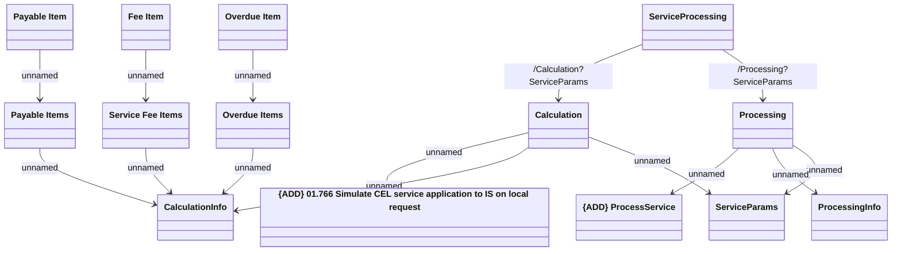

# Process service

```mermaid
classDiagram
    class Fee_Item["Fee Item"]
    class Payable_Item["Payable Item"]
    class Overdue_Item["Overdue Item"]
    class Service_Fee_Items["Service Fee Items"]
    class Payable_Items["Payable Items"]
    class Overdue_Items["Overdue Items"]
    class ADD_ProcessService["{ADD} ProcessService"]
    class ADD_01_766_Simulate_CEL_service_application_to_IS_on_local_r["{ADD} 01.766 Simulate CEL service application to IS on local request"]
    class Processing["Processing"]
    class Calculation["Calculation"]
    class ServiceParams["ServiceParams"]
    class ProcessingInfo["ProcessingInfo"]
    class CalculationInfo["CalculationInfo"]
    class ServiceProcessing["ServiceProcessing"]
    Processing --> ServiceParams : unnamed
    ServiceProcessing --> Processing : /Processing?ServiceParams
    Processing --> ProcessingInfo : unnamed
    Processing --> ADD_ProcessService : unnamed
    ServiceProcessing --> Calculation : /Calculation?ServiceParams
    Calculation --> ServiceParams : unnamed
    Calculation --> CalculationInfo : unnamed
    Calculation --> ADD_01_766_Simulate_CEL_service_application_to_IS_on_local_r : unnamed
    Overdue_Item --> Overdue_Items : unnamed
    Overdue_Items --> CalculationInfo : unnamed
    Fee_Item --> Service_Fee_Items : unnamed
    Service_Fee_Items --> CalculationInfo : unnamed
    Payable_Item --> Payable_Items : unnamed
    Payable_Items --> CalculationInfo : unnamed
```
