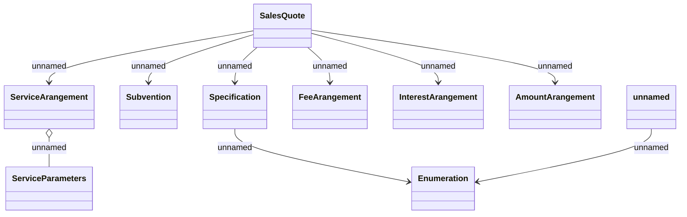

# Sales Quote (CM)

- **Diagram Type**: Logical
- **Package**: HomerSelect/BSL/Modules/Supplements (SUP_NG)/Analytical Model/Contract Supplements/Sales Quote processing/Sales Quote (CM)
- **Diagram ID**: 160122
- **Elements**: 13
- **Connectors**: 9

