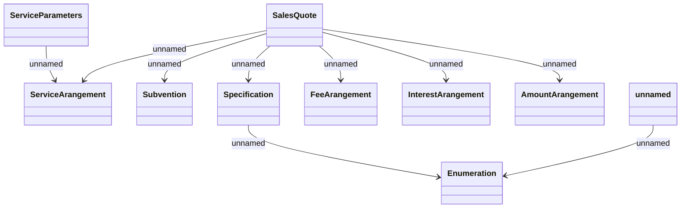

# Sales Quote (CM)

```mermaid
classDiagram
    class ServiceParameters["ServiceParameters"]
    class ServiceArangement["ServiceArangement"]
    class Enumeration["Enumeration"]
    class Subvention["Subvention"]
    class Specification["Specification"]
    class FeeArangement["FeeArangement"]
    class InterestArangement["InterestArangement"]
    class AmountArangement["AmountArangement"]
    class SalesQuote["SalesQuote"]
    SalesQuote --> ServiceArangement : unnamed
    ServiceParameters --> ServiceArangement : unnamed
    Specification --> Enumeration : unnamed
    unnamed --> Enumeration : unnamed
    SalesQuote --> Subvention : unnamed
    SalesQuote --> Specification : unnamed
    SalesQuote --> FeeArangement : unnamed
    SalesQuote --> InterestArangement : unnamed
    SalesQuote --> AmountArangement : unnamed
```
