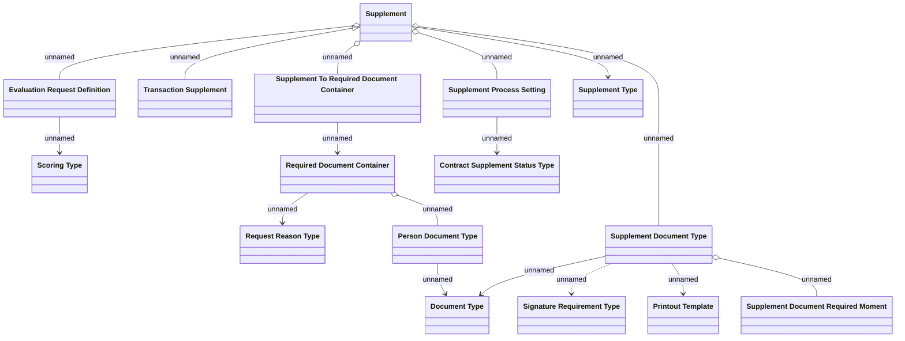

# Supplement definition - Logical Data Model

- **Diagram Type**: Logical
- **Package**: HomerSelect/BSL/Modules/Supplements (SUP_NG)/Analytical Model/Supplement definition/Logical Data Model
- **Diagram ID**: 163996
- **Elements**: 16
- **Connectors**: 16

