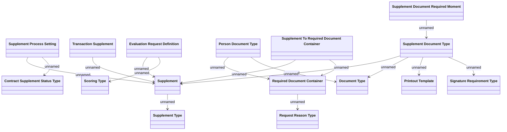

# Supplement definition - Logical Data Model

```mermaid
classDiagram
    class Scoring_Type["Scoring Type"]
    class Supplement_Process_Setting["Supplement Process Setting"]
    class Transaction_Supplement["Transaction Supplement"]
    class Evaluation_Request_Definition["Evaluation Request Definition"]
    class Signature_Requirement_Type["Signature Requirement Type"]
    class Request_Reason_Type["Request Reason Type"]
    class Required_Document_Container["Required Document Container"]
    class Person_Document_Type["Person Document Type"]
    class Supplement_To_Required_Document_Container["Supplement To Required Document Container"]
    class Contract_Supplement_Status_Type["Contract Supplement Status Type"]
    class Supplement_Type["Supplement Type"]
    class Supplement_Document_Required_Moment["Supplement Document Required Moment"]
    class Printout_Template["Printout Template"]
    class Document_Type["Document Type"]
    class Supplement_Document_Type["Supplement Document Type"]
    class Supplement["Supplement"]
    Person_Document_Type --> Document_Type : unnamed
    Supplement_Document_Type --> Signature_Requirement_Type : unnamed
    Required_Document_Container --> Request_Reason_Type : unnamed
    Person_Document_Type --> Required_Document_Container : unnamed
    Supplement_To_Required_Document_Container --> Required_Document_Container : unnamed
    Supplement_Process_Setting --> Contract_Supplement_Status_Type : unnamed
    Evaluation_Request_Definition --> Scoring_Type : unnamed
    Supplement_Document_Type --> Printout_Template : unnamed
    Evaluation_Request_Definition --> Supplement : unnamed
    Supplement_Document_Type --> Document_Type : unnamed
    Supplement_Document_Required_Moment --> Supplement_Document_Type : unnamed
    Supplement_To_Required_Document_Container --> Supplement : unnamed
    Supplement_Process_Setting --> Supplement : unnamed
    Supplement_Document_Type --> Supplement : unnamed
    Transaction_Supplement --> Supplement : unnamed
    Supplement --> Supplement_Type : unnamed
```
