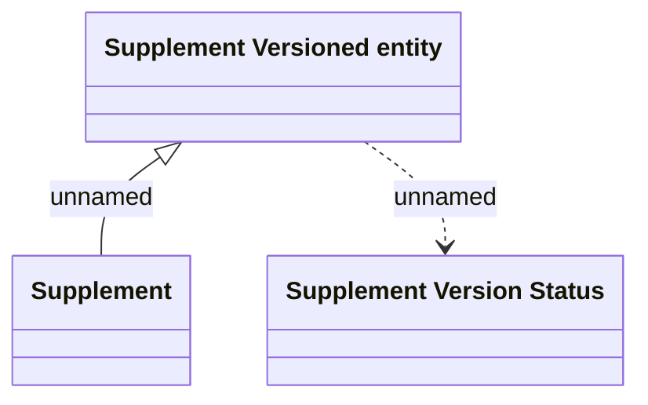

# Supplement versioned entity - Logical Data Model

- **Diagram Type**: Logical
- **Package**: HomerSelect/BSL/Modules/Supplements (SUP_NG)/Analytical Model/Supplement definition/Logical Data Model
- **Diagram ID**: 163997
- **Elements**: 3
- **Connectors**: 2

