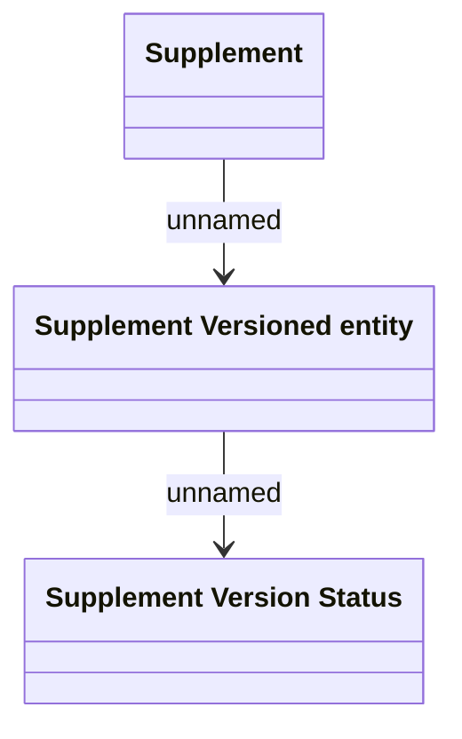

# Supplement versioned entity - Logical Data Model

```mermaid
classDiagram
    class Supplement["Supplement"]
    class Supplement_Version_Status["Supplement Version Status"]
    class Supplement_Versioned_entity["Supplement Versioned entity"]
    Supplement --> Supplement_Versioned_entity : unnamed
    Supplement_Versioned_entity --> Supplement_Version_Status : unnamed
```
