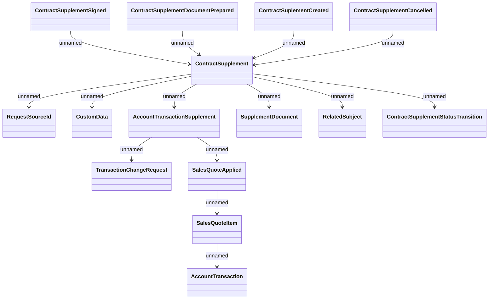

# Contract Supplement notifications

```mermaid
classDiagram
    class SalesQuoteItem["SalesQuoteItem"]
    class RequestSourceId["RequestSourceId"]
    class CustomData["CustomData"]
    class TransactionChangeRequest["TransactionChangeRequest"]
    class SalesQuoteApplied["SalesQuoteApplied"]
    class AccountTransaction["AccountTransaction"]
    class AccountTransactionSupplement["AccountTransactionSupplement"]
    class ContractSupplementSigned["ContractSupplementSigned"]
    class ContractSupplementDocumentPrepared["ContractSupplementDocumentPrepared"]
    class ContractSuplementCreated["ContractSuplementCreated"]
    class ContractSupplementCancelled["ContractSupplementCancelled"]
    class SupplementDocument["SupplementDocument"]
    class RelatedSubject["RelatedSubject"]
    class ContractSupplementStatusTransition["ContractSupplementStatusTransition"]
    class ContractSupplement["ContractSupplement"]
    ContractSupplementSigned --> ContractSupplement : unnamed
    ContractSupplementDocumentPrepared --> ContractSupplement : unnamed
    ContractSuplementCreated --> ContractSupplement : unnamed
    ContractSupplementCancelled --> ContractSupplement : unnamed
    ContractSupplement --> ContractSupplementStatusTransition : unnamed
    ContractSupplement --> RelatedSubject : unnamed
    ContractSupplement --> SupplementDocument : unnamed
    ContractSupplement --> AccountTransactionSupplement : unnamed
    SalesQuoteItem --> AccountTransaction : unnamed
    AccountTransactionSupplement --> SalesQuoteApplied : unnamed
    AccountTransactionSupplement --> TransactionChangeRequest : unnamed
    ContractSupplement --> CustomData : unnamed
    ContractSupplement --> RequestSourceId : unnamed
    SalesQuoteApplied --> SalesQuoteItem : unnamed
```
