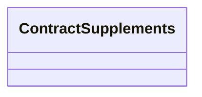

# Contract Supplement services

- **Diagram Type**: Logical
- **Package**: HomerSelect/BSL/Modules/Supplements (SUP_NG)/Interface Provided/Web Services/Contract Supplement services
- **Diagram ID**: 163449
- **Elements**: 1
- **Connectors**: 0

