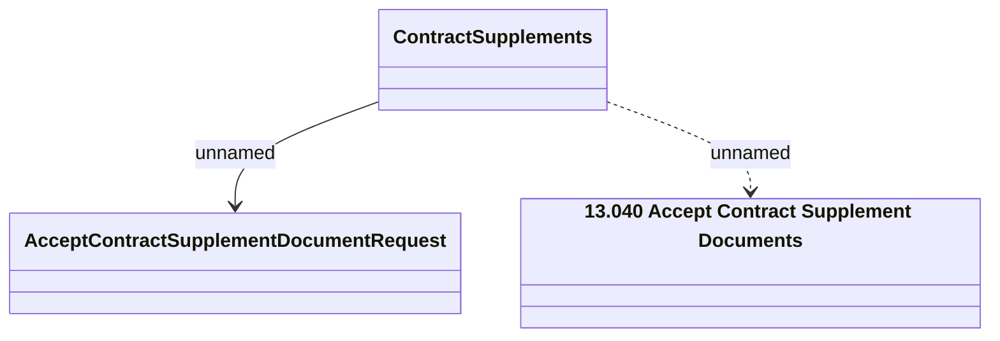

# Accept Contract Supplement Documents

- **Diagram Type**: Logical
- **Package**: HomerSelect/BSL/Modules/Supplements (SUP_NG)/Interface Provided/Web Services/Contract Supplement services/Accept Contract Supplement Documents
- **Diagram ID**: 160262
- **Elements**: 3
- **Connectors**: 2

