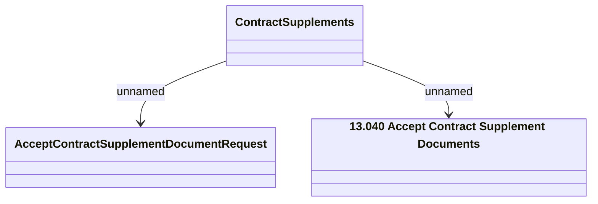

# Accept Contract Supplement Documents

```mermaid
classDiagram
    class AcceptContractSupplementDocumentRequest["AcceptContractSupplementDocumentRequest"]
    class n_13_040_Accept_Contract_Supplement_Documents["13.040 Accept Contract Supplement Documents"]
    class ContractSupplements["ContractSupplements"]
    ContractSupplements --> AcceptContractSupplementDocumentRequest : unnamed
    ContractSupplements --> n_13_040_Accept_Contract_Supplement_Documents : unnamed
```
