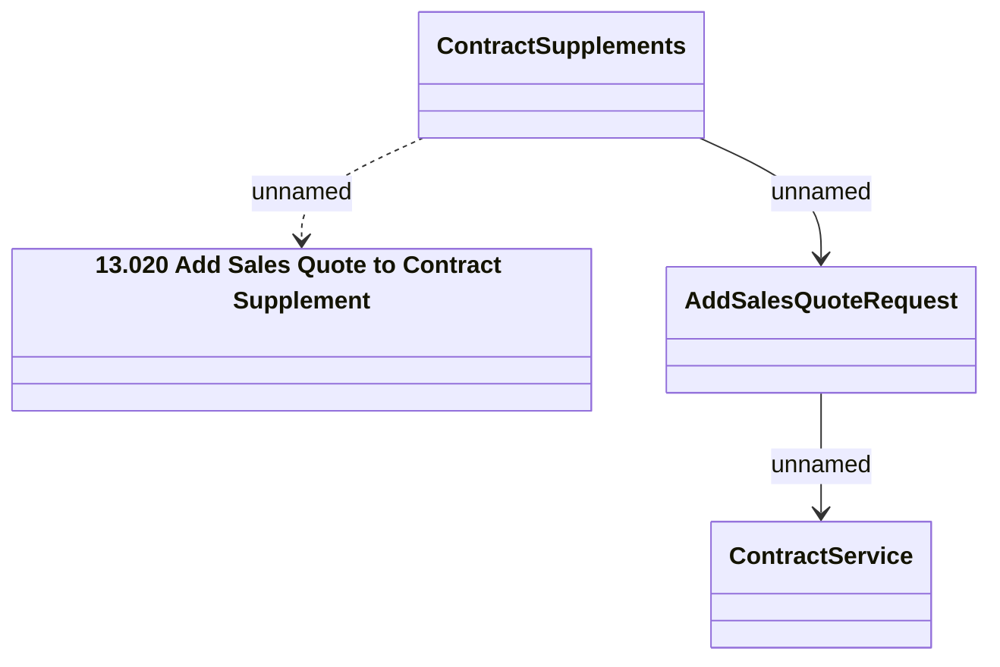

# Add Sales Quote to Contract Supplement

- **Diagram Type**: Logical
- **Package**: HomerSelect/BSL/Modules/Supplements (SUP_NG)/Interface Provided/Web Services/Contract Supplement services/Add Sales Quote to Contract Supplement
- **Diagram ID**: 163452
- **Elements**: 4
- **Connectors**: 3

