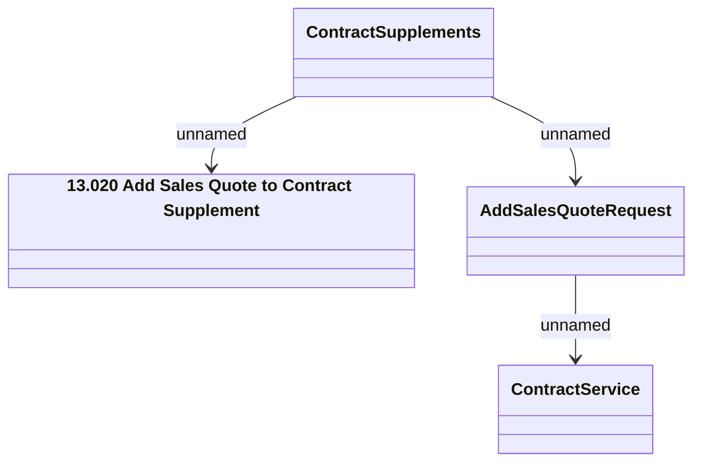

# Add Sales Quote to Contract Supplement

```mermaid
classDiagram
    class ContractService["ContractService"]
    class n_13_020_Add_Sales_Quote_to_Contract_Supplement["13.020 Add Sales Quote to Contract Supplement"]
    class AddSalesQuoteRequest["AddSalesQuoteRequest"]
    class ContractSupplements["ContractSupplements"]
    ContractSupplements --> AddSalesQuoteRequest : unnamed
    ContractSupplements --> n_13_020_Add_Sales_Quote_to_Contract_Supplement : unnamed
    AddSalesQuoteRequest --> ContractService : unnamed
```
