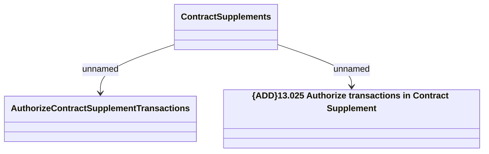

# Authorize Contract Supplement Transactions

```mermaid
classDiagram
    class ADD_13_025_Authorize_transactions_in_Contract_Supplement["{ADD}13.025 Authorize transactions in Contract Supplement"]
    class AuthorizeContractSupplementTransactions["AuthorizeContractSupplementTransactions"]
    class ContractSupplements["ContractSupplements"]
    ContractSupplements --> AuthorizeContractSupplementTransactions : unnamed
    ContractSupplements --> ADD_13_025_Authorize_transactions_in_Contract_Supplement : unnamed
```
