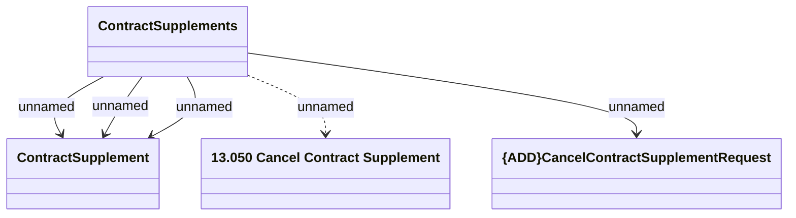

# Cancel Contract Supplement method

- **Diagram Type**: Logical
- **Package**: HomerSelect/BSL/Modules/Supplements (SUP_NG)/Interface Provided/Web Services/Contract Supplement services/Cancel Contract Supplement
- **Diagram ID**: 158779
- **Elements**: 4
- **Connectors**: 5

