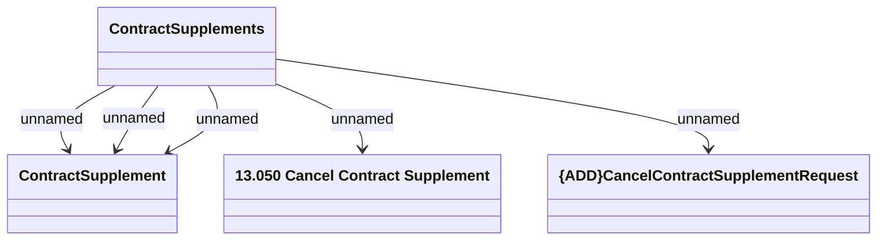

# Cancel Contract Supplement method

```mermaid
classDiagram
    class ContractSupplement["ContractSupplement"]
    class ADD_CancelContractSupplementRequest["{ADD}CancelContractSupplementRequest"]
    class n_13_050_Cancel_Contract_Supplement["13.050 Cancel Contract Supplement"]
    class ContractSupplements["ContractSupplements"]
    ContractSupplements --> ContractSupplement : unnamed
    ContractSupplements --> n_13_050_Cancel_Contract_Supplement : unnamed
    ContractSupplements --> ContractSupplement : unnamed
    ContractSupplements --> ADD_CancelContractSupplementRequest : unnamed
    ContractSupplements --> ContractSupplement : unnamed
```
