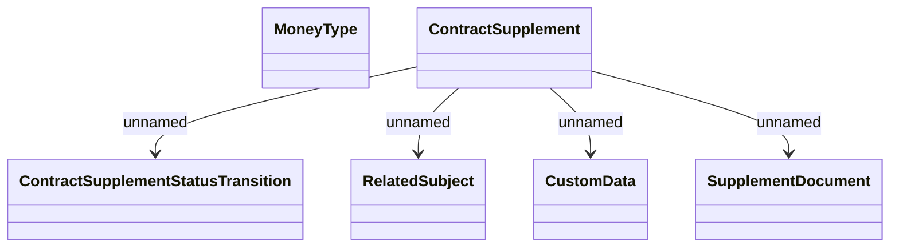

# Common structures

- **Diagram Type**: Logical
- **Package**: HomerSelect/BSL/Modules/Supplements (SUP_NG)/Interface Provided/Web Services/Contract Supplement services/Common structures
- **Diagram ID**: 163447
- **Elements**: 6
- **Connectors**: 4

