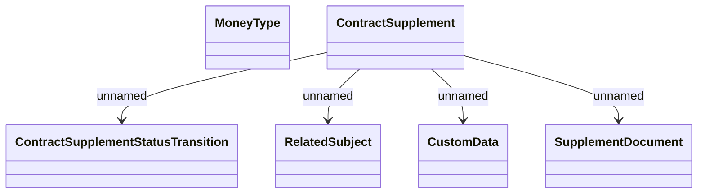

# Common structures

```mermaid
classDiagram
    class MoneyType["MoneyType"]
    class SupplementDocument["SupplementDocument"]
    class CustomData["CustomData"]
    class RelatedSubject["RelatedSubject"]
    class ContractSupplementStatusTransition["ContractSupplementStatusTransition"]
    class ContractSupplement["ContractSupplement"]
    ContractSupplement --> ContractSupplementStatusTransition : unnamed
    ContractSupplement --> RelatedSubject : unnamed
    ContractSupplement --> CustomData : unnamed
    ContractSupplement --> SupplementDocument : unnamed
```
