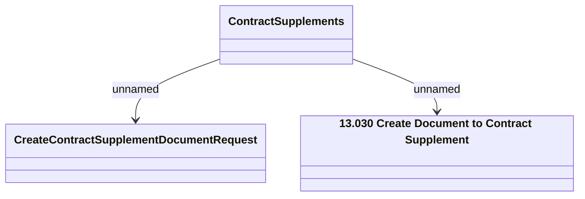

# Create Contract Supplement Documents

```mermaid
classDiagram
    class n_13_030_Create_Document_to_Contract_Supplement["13.030 Create Document to Contract Supplement"]
    class CreateContractSupplementDocumentRequest["CreateContractSupplementDocumentRequest"]
    class ContractSupplements["ContractSupplements"]
    ContractSupplements --> CreateContractSupplementDocumentRequest : unnamed
    ContractSupplements --> n_13_030_Create_Document_to_Contract_Supplement : unnamed
```
