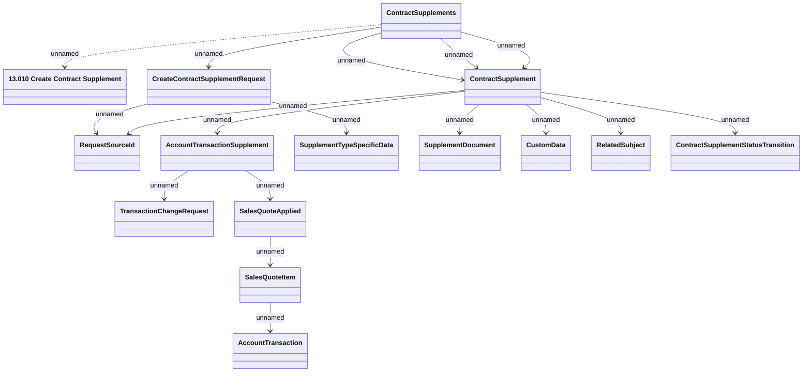

# Create Contract Supplement

- **Diagram Type**: Logical
- **Package**: HomerSelect/BSL/Modules/Supplements (SUP_NG)/Interface Provided/Web Services/Contract Supplement services/Create Contract Supplement
- **Diagram ID**: 163446
- **Elements**: 15
- **Connectors**: 17

