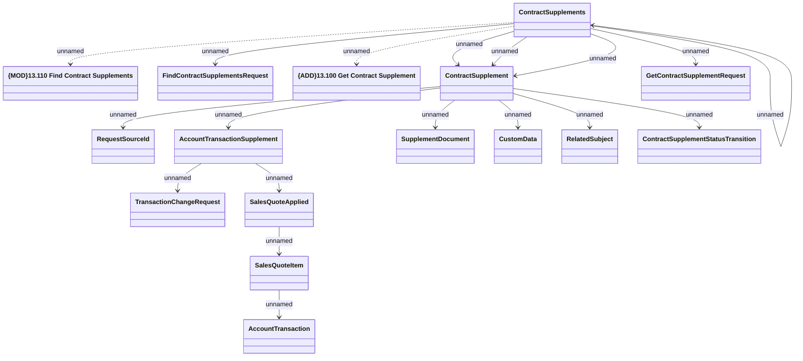

# Get Contract Supplements

- **Diagram Type**: Logical
- **Package**: HomerSelect/BSL/Modules/Supplements (SUP_NG)/Interface Provided/Web Services/Contract Supplement services/Get Contract Supplements
- **Diagram ID**: 163448
- **Elements**: 17
- **Connectors**: 18

