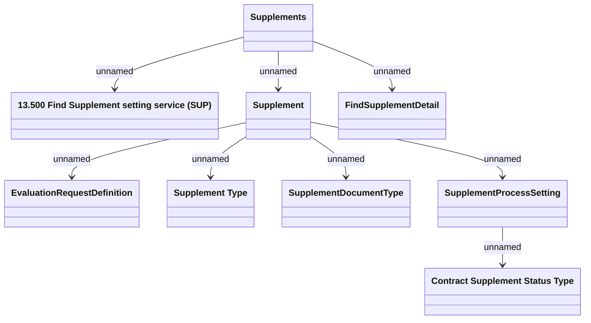

# Find Supplement definition service

- **Diagram Type**: Logical
- **Package**: HomerSelect/BSL/Modules/Supplements (SUP_NG)/Interface Provided/Web Services/Supplement definition services/Getting Supplement definition service
- **Diagram ID**: 161697
- **Elements**: 9
- **Connectors**: 8

