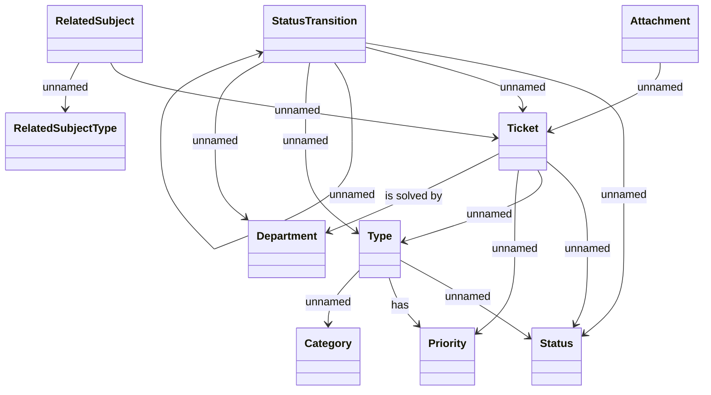

# Part 1

```mermaid
classDiagram
    class Department["Department"]
    class RelatedSubjectType["RelatedSubjectType"]
    class RelatedSubject["RelatedSubject"]
    class Category["Category"]
    class Attachment["Attachment"]
    class Priority["Priority"]
    class Type["Type"]
    class StatusTransition["StatusTransition"]
    class Ticket["Ticket"]
    class Status["Status"]
    Type --> Status : unnamed
    Ticket --> Status : unnamed
    StatusTransition --> Status : unnamed
    StatusTransition --> Ticket : unnamed
    Attachment --> Ticket : unnamed
    RelatedSubject --> Ticket : unnamed
    StatusTransition --> StatusTransition : unnamed
    StatusTransition --> Type : unnamed
    Ticket --> Type : unnamed
    Ticket --> Priority : unnamed
    Type --> Priority : has
    Type --> Category : unnamed
    RelatedSubject --> RelatedSubjectType : unnamed
    Ticket --> Department : is solved by
    StatusTransition --> Department : unnamed
```
