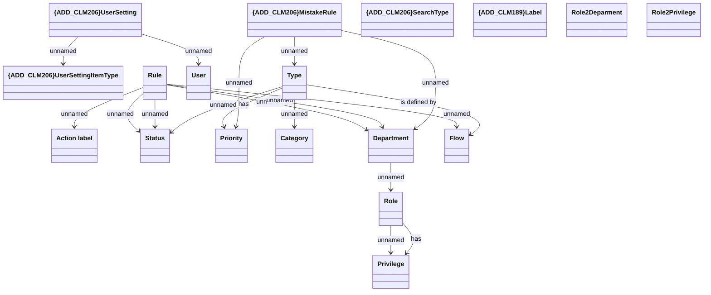

# Part 2

```mermaid
classDiagram
    class ADD_CLM206_MistakeRule["{ADD_CLM206}MistakeRule"]
    class ADD_CLM206_UserSettingItemType["{ADD_CLM206}UserSettingItemType"]
    class ADD_CLM206_UserSetting["{ADD_CLM206}UserSetting"]
    class ADD_CLM206_SearchType["{ADD_CLM206}SearchType"]
    class ADD_CLM189_Label["{ADD_CLM189}Label"]
    class Action_label["Action label"]
    class Role2Deparment["Role2Deparment"]
    class Status["Status"]
    class Type["Type"]
    class Priority["Priority"]
    class Category["Category"]
    class Department["Department"]
    class User["User"]
    class Flow["Flow"]
    class Role2Privilege["Role2Privilege"]
    class Privilege["Privilege"]
    class Role["Role"]
    class Rule["Rule"]
    Rule --> Department : unnamed
    Rule --> Action_label : unnamed
    Rule --> Status : unnamed
    Rule --> Status : unnamed
    Type --> Status : unnamed
    ADD_CLM206_MistakeRule --> Type : unnamed
    Type --> Priority : has
    ADD_CLM206_UserSetting --> ADD_CLM206_UserSettingItemType : unnamed
    Type --> Category : unnamed
    Department --> Role : unnamed
    Rule --> Department : unnamed
    ADD_CLM206_MistakeRule --> Department : unnamed
    ADD_CLM206_UserSetting --> User : unnamed
    Rule --> Flow : unnamed
    Type --> Flow : is defined by
    Role --> Privilege : unnamed
    Role --> Privilege : has
    ADD_CLM206_MistakeRule --> Priority : unnamed
```
