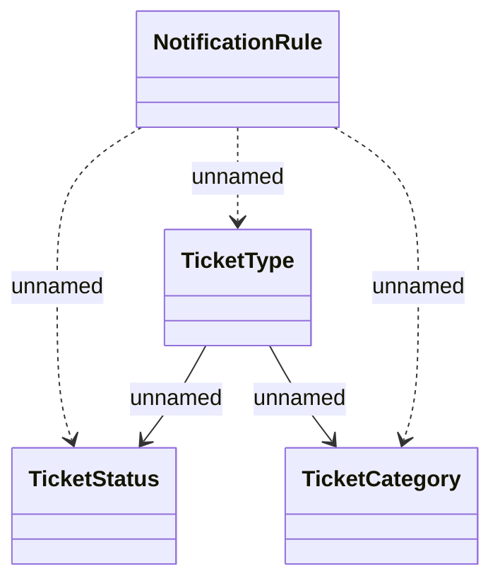

# Ticket notification setting - Logical Data Model

- **Diagram Type**: Logical
- **Package**: HomerSelect/BSL/Modules/Ticketing (TCK)/Analytical Model/Logical Data Model
- **Diagram ID**: 156034
- **Elements**: 4
- **Connectors**: 5

