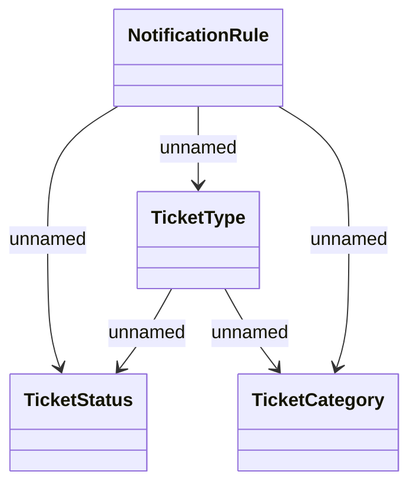

# Ticket notification setting - Logical Data Model

```mermaid
classDiagram
    class TicketCategory["TicketCategory"]
    class TicketType["TicketType"]
    class TicketStatus["TicketStatus"]
    class NotificationRule["NotificationRule"]
    TicketType --> TicketStatus : unnamed
    NotificationRule --> TicketStatus : unnamed
    NotificationRule --> TicketType : unnamed
    TicketType --> TicketCategory : unnamed
    NotificationRule --> TicketCategory : unnamed
```
