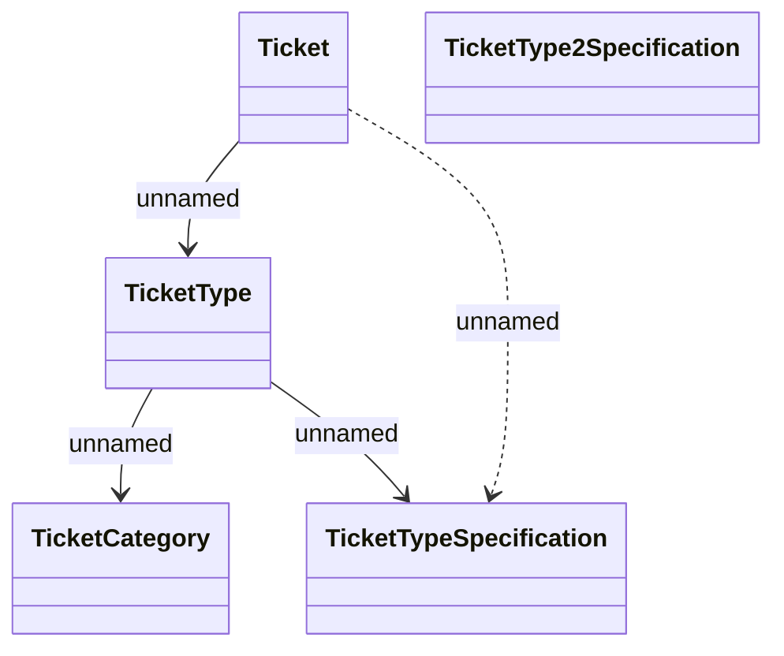

# TicketType extension - Logical Data Model

- **Diagram Type**: Logical
- **Package**: HomerSelect/BSL/Modules/Ticketing (TCK)/Analytical Model/Logical Data Model
- **Diagram ID**: 156033
- **Elements**: 5
- **Connectors**: 4

