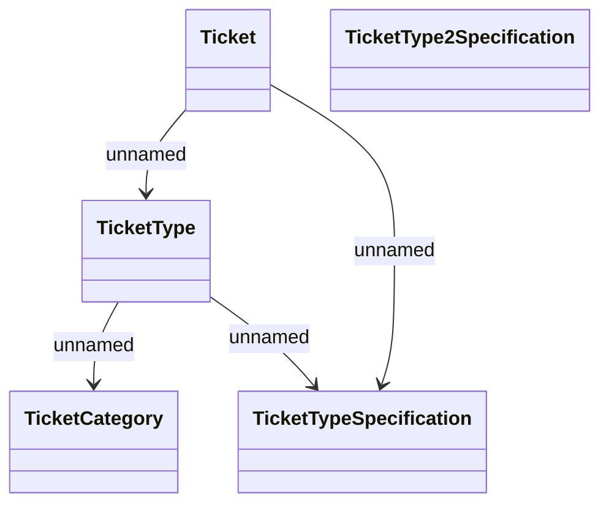

# TicketType extension - Logical Data Model

```mermaid
classDiagram
    class Ticket["Ticket"]
    class TicketType2Specification["TicketType2Specification"]
    class TicketTypeSpecification["TicketTypeSpecification"]
    class TicketCategory["TicketCategory"]
    class TicketType["TicketType"]
    Ticket --> TicketType : unnamed
    TicketType --> TicketCategory : unnamed
    Ticket --> TicketTypeSpecification : unnamed
    TicketType --> TicketTypeSpecification : unnamed
```
