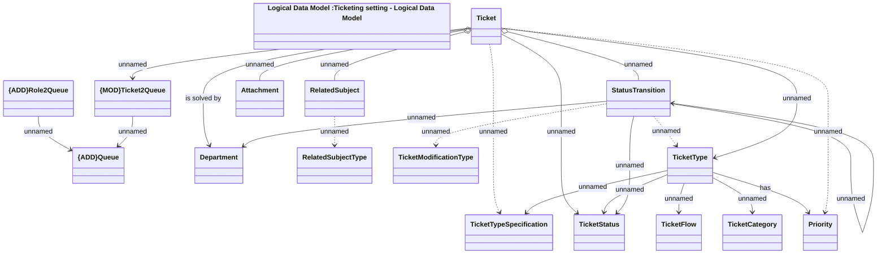

# Ticketing - Logical Data Model

- **Diagram Type**: Logical
- **Package**: HomerSelect/BSL/Modules/Ticketing (TCK)/Analytical Model/Logical Data Model
- **Diagram ID**: 156031
- **Elements**: 17
- **Connectors**: 22

