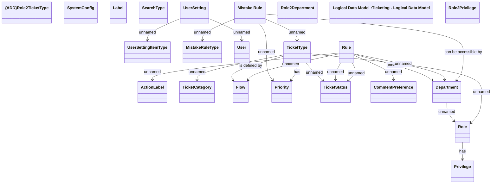

# Ticketing setting - Logical Data Model

```mermaid
classDiagram
    class ADD_Role2TicketType["{ADD}Role2TicketType"]
    class SystemConfig["SystemConfig"]
    class Label["Label"]
    class SearchType["SearchType"]
    class UserSettingItemType["UserSettingItemType"]
    class MistakeRuleType["MistakeRuleType"]
    class Mistake_Rule["Mistake Rule"]
    class UserSetting["UserSetting"]
    class ActionLabel["ActionLabel"]
    class Role2Department["Role2Department"]
    class User["User"]
    class TicketCategory["TicketCategory"]
    class Logical_Data_Model_Ticketing_Logical_Data_Model["Logical Data Model :Ticketing - Logical Data Model"]
    class Flow["Flow"]
    class Priority["Priority"]
    class TicketType["TicketType"]
    class TicketStatus["TicketStatus"]
    class Role2Privilege["Role2Privilege"]
    class Privilege["Privilege"]
    class Role["Role"]
    class CommentPreference["CommentPreference"]
    class Rule["Rule"]
    class Department["Department"]
    Mistake_Rule --> MistakeRuleType : unnamed
    Rule --> ActionLabel : unnamed
    UserSetting --> User : unnamed
    TicketType --> TicketCategory : unnamed
    TicketType --> Flow : is defined by
    Rule --> Flow : unnamed
    Mistake_Rule --> Priority : unnamed
    TicketType --> Priority : has
    UserSetting --> UserSettingItemType : unnamed
    TicketType --> TicketStatus : unnamed
    Rule --> Department : unnamed
    Rule --> TicketStatus : unnamed
    Rule --> TicketStatus : unnamed
    Role --> Privilege : has
    Department --> Role : unnamed
    TicketType --> Role : unnamed
    Rule --> CommentPreference : unnamed
    Rule --> Department : unnamed
    Mistake_Rule --> Department : can be accessible by
    Mistake_Rule --> TicketType : unnamed
```
