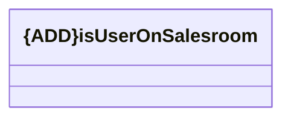

# isUserOnSalesroom

- **Diagram Type**: Logical
- **Package**: HomerSelect/BSL/Modules/Ticketing (TCK)/Interface Consumed/REST/HOMESIS/v1/isUserOnSalesroom
- **Diagram ID**: 156386
- **Elements**: 1
- **Connectors**: 0

