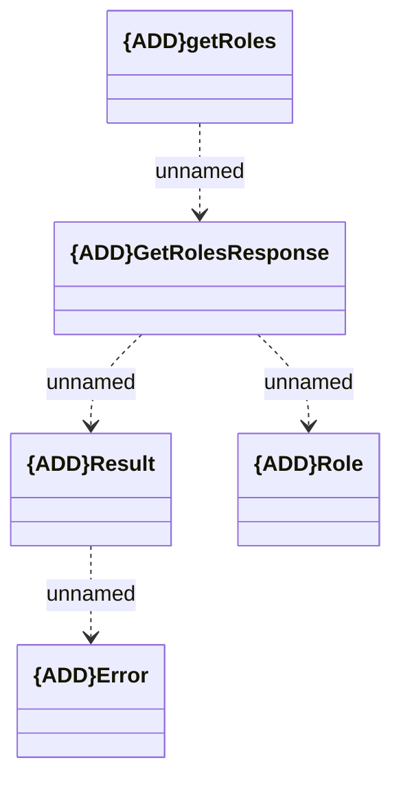

# getRoles

- **Diagram Type**: Logical
- **Package**: HomerSelect/BSL/Modules/Ticketing (TCK)/Interface Consumed/REST/UMC/getRoles
- **Diagram ID**: 156060
- **Elements**: 5
- **Connectors**: 4

```mermaid
classDiagram
    class ADD_Error["{ADD}Error"]
    class ADD_Result["{ADD}Result"]
    class ADD_Role["{ADD}Role"]
    class ADD_GetRolesResponse["{ADD}GetRolesResponse"]
    class ADD_getRoles["{ADD}getRoles"]
    ADD_getRoles ..> ADD_GetRolesResponse : unnamed
    ADD_GetRolesResponse ..> ADD_Role : unnamed
    ADD_GetRolesResponse ..> ADD_Result : unnamed
    ADD_Result ..> ADD_Error : unnamed
```
