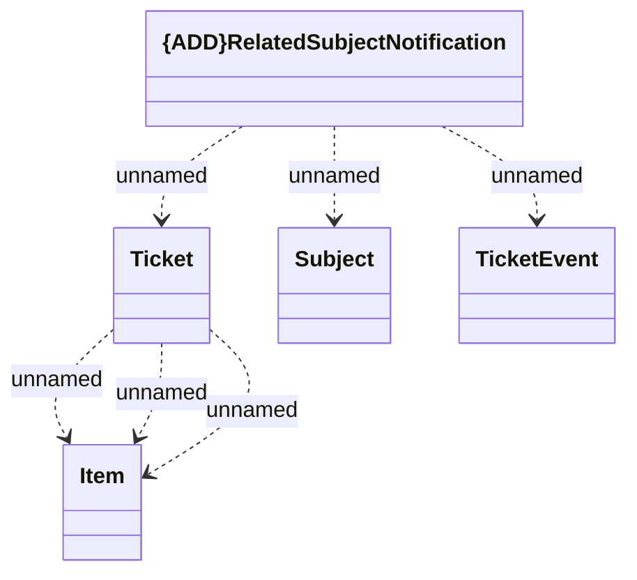

# RelatedSubject

- **Diagram Type**: Logical
- **Package**: HomerSelect/BSL/Modules/Ticketing (TCK)/Interface Provided/Generated messages/v1.0/Related Subject Notification
- **Diagram ID**: 156089
- **Elements**: 5
- **Connectors**: 6

