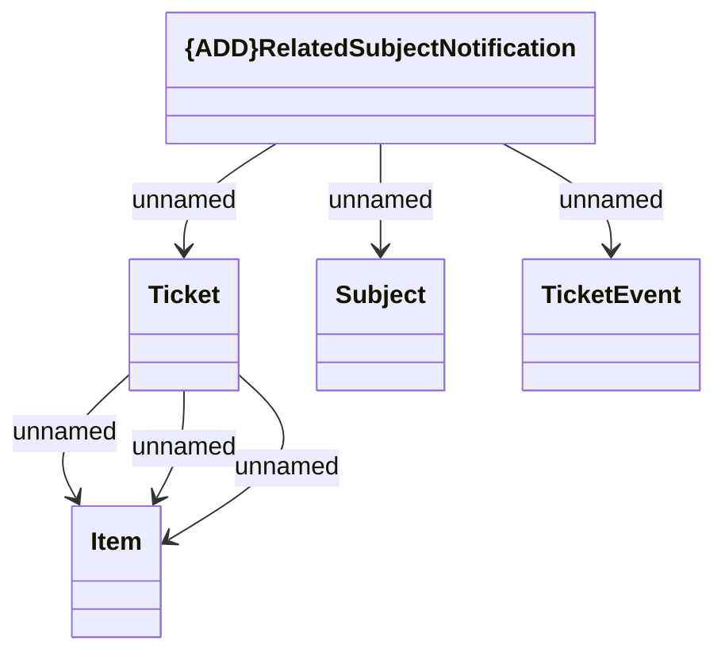

# RelatedSubject

```mermaid
classDiagram
    class Item["Item"]
    class Ticket["Ticket"]
    class Subject["Subject"]
    class TicketEvent["TicketEvent"]
    class ADD_RelatedSubjectNotification["{ADD}RelatedSubjectNotification"]
    ADD_RelatedSubjectNotification --> TicketEvent : unnamed
    ADD_RelatedSubjectNotification --> Subject : unnamed
    ADD_RelatedSubjectNotification --> Ticket : unnamed
    Ticket --> Item : unnamed
    Ticket --> Item : unnamed
    Ticket --> Item : unnamed
```
