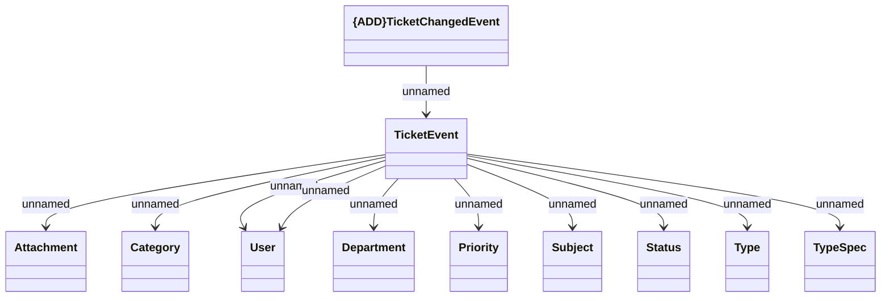

# TicketChangedEvent

```mermaid
classDiagram
    class TypeSpec["TypeSpec"]
    class Type["Type"]
    class Status["Status"]
    class Subject["Subject"]
    class Priority["Priority"]
    class Department["Department"]
    class User["User"]
    class Category["Category"]
    class Attachment["Attachment"]
    class TicketEvent["TicketEvent"]
    class ADD_TicketChangedEvent["{ADD}TicketChangedEvent"]
    ADD_TicketChangedEvent --> TicketEvent : unnamed
    TicketEvent --> Attachment : unnamed
    TicketEvent --> Category : unnamed
    TicketEvent --> User : unnamed
    TicketEvent --> User : unnamed
    TicketEvent --> Department : unnamed
    TicketEvent --> Priority : unnamed
    TicketEvent --> Subject : unnamed
    TicketEvent --> Status : unnamed
    TicketEvent --> Type : unnamed
    TicketEvent --> TypeSpec : unnamed
```
