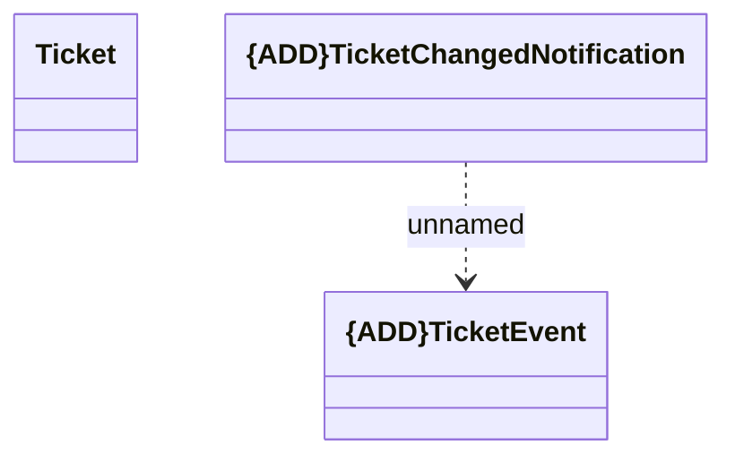

# TicketChangedNotification

- **Diagram Type**: Logical
- **Package**: HomerSelect/BSL/Modules/Ticketing (TCK)/Interface Provided/Generated messages/v1.0/TicketChangedNotification
- **Diagram ID**: 156041
- **Elements**: 3
- **Connectors**: 1

