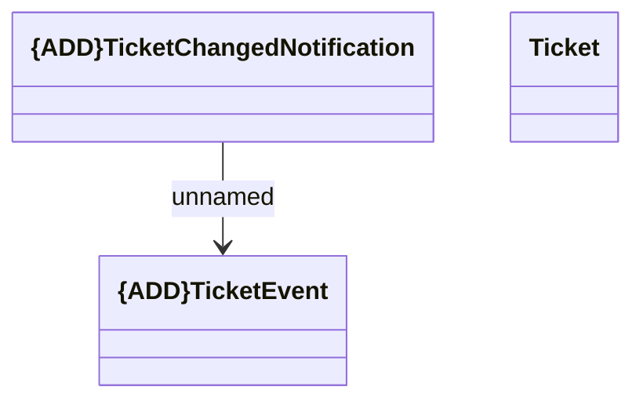

# TicketChangedNotification

```mermaid
classDiagram
    class ADD_TicketEvent["{ADD}TicketEvent"]
    class ADD_TicketChangedNotification["{ADD}TicketChangedNotification"]
    class Ticket["Ticket"]
    ADD_TicketChangedNotification --> ADD_TicketEvent : unnamed
```
