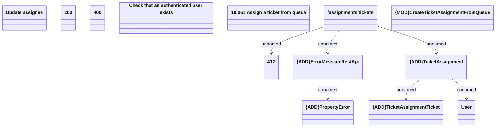

# assignTicketFromQueue

```mermaid
classDiagram
    class User["User"]
    class Update_assignee["Update assignee"]
    class ADD_PropertyError["{ADD}PropertyError"]
    class n_412["412"]
    class n_200["200"]
    class n_400["400"]
    class Check_that_an_authenticated_user_exists["Check that an authenticated user exists
"]
    class ADD_TicketAssignmentTicket["{ADD}TicketAssignmentTicket"]
    class ADD_TicketAssignment["{ADD}TicketAssignment"]
    class ADD_ErrorMessageRestApi["{ADD}ErrorMessageRestApi"]
    class n_10_061_Assign_a_ticket_from_queue["10.061 Assign a ticket from queue"]
    class assignments_tickets["/assignments/tickets"]
    class MOD_CreateTicketAssignmentFromQueue["{MOD}CreateTicketAssignmentFromQueue"]
    assignments_tickets --> ADD_ErrorMessageRestApi : unnamed
    assignments_tickets --> ADD_TicketAssignment : unnamed
    assignments_tickets --> n_412 : unnamed
    ADD_TicketAssignment --> ADD_TicketAssignmentTicket : unnamed
    ADD_TicketAssignment --> User : unnamed
    ADD_ErrorMessageRestApi --> ADD_PropertyError : unnamed
```
