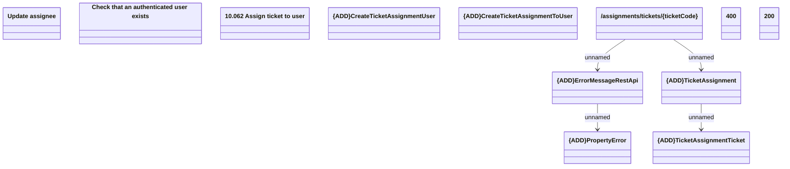

# assignTicketToUser

```mermaid
classDiagram
    class ADD_TicketAssignment["{ADD}TicketAssignment"]
    class ADD_TicketAssignmentTicket["{ADD}TicketAssignmentTicket"]
    class Update_assignee["Update assignee"]
    class Check_that_an_authenticated_user_exists["Check that an authenticated user exists
"]
    class n_10_062_Assign_ticket_to_user["10.062 Assign ticket to user"]
    class ADD_PropertyError["{ADD}PropertyError"]
    class ADD_ErrorMessageRestApi["{ADD}ErrorMessageRestApi"]
    class ADD_CreateTicketAssignmentUser["{ADD}CreateTicketAssignmentUser"]
    class ADD_CreateTicketAssignmentToUser["{ADD}CreateTicketAssignmentToUser"]
    class assignments_tickets_ticketCode["/assignments/tickets/{ticketCode}"]
    class n_400["400"]
    class n_200["200"]
    assignments_tickets_ticketCode --> ADD_ErrorMessageRestApi : unnamed
    assignments_tickets_ticketCode --> ADD_TicketAssignment : unnamed
    ADD_TicketAssignment --> ADD_TicketAssignmentTicket : unnamed
    ADD_ErrorMessageRestApi --> ADD_PropertyError : unnamed
```
