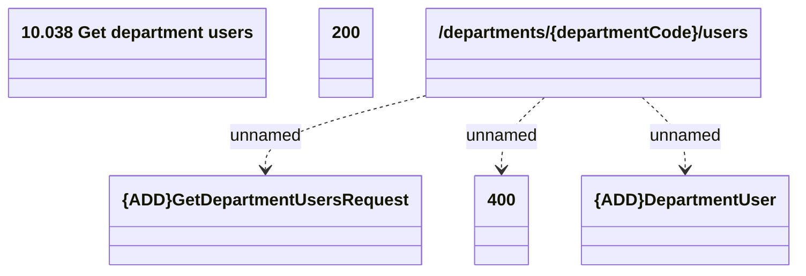

# getDepartmentUsers

- **Diagram Type**: Logical
- **Package**: HomerSelect/BSL/Modules/Ticketing (TCK)/Interface Provided/Web Services/Ticketing API/departments/getDepartmentUsers
- **Diagram ID**: 159969
- **Elements**: 6
- **Connectors**: 3

