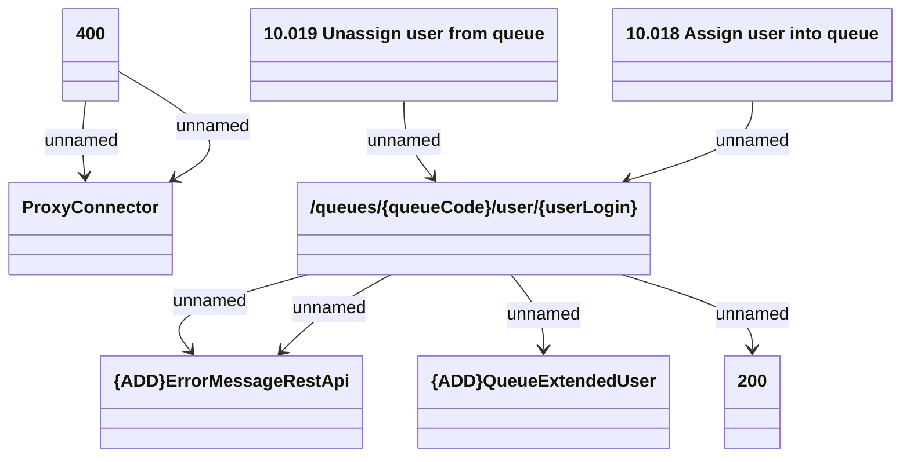

# assignUserIntoQueue

```mermaid
classDiagram
    class n_10_019_Unassign_user_from_queue["10.019 Unassign user from queue"]
    class ProxyConnector["ProxyConnector"]
    class ProxyConnector["ProxyConnector"]
    class n_10_018_Assign_user_into_queue["10.018 Assign user into queue"]
    class n_400["400"]
    class n_200["200"]
    class ADD_QueueExtendedUser["{ADD}QueueExtendedUser"]
    class ADD_ErrorMessageRestApi["{ADD}ErrorMessageRestApi"]
    class queues_queueCode_user_userLogin["/queues/{queueCode}/user/{userLogin}"]
    queues_queueCode_user_userLogin --> ADD_ErrorMessageRestApi : unnamed
    queues_queueCode_user_userLogin --> ADD_ErrorMessageRestApi : unnamed
    queues_queueCode_user_userLogin --> ADD_QueueExtendedUser : unnamed
    queues_queueCode_user_userLogin --> n_200 : unnamed
    n_400 --> ProxyConnector : unnamed
    n_400 --> ProxyConnector : unnamed
    n_10_019_Unassign_user_from_queue --> queues_queueCode_user_userLogin : unnamed
    n_10_018_Assign_user_into_queue --> queues_queueCode_user_userLogin : unnamed
```
