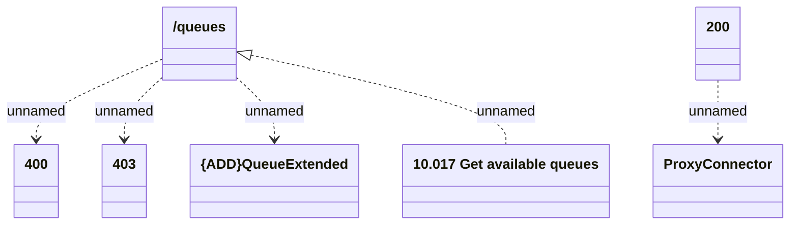

# listQueues

- **Diagram Type**: Logical
- **Package**: HomerSelect/BSL/Modules/Ticketing (TCK)/Interface Provided/Web Services/Ticketing API/queues/listQueues
- **Diagram ID**: 159947
- **Elements**: 7
- **Connectors**: 5

