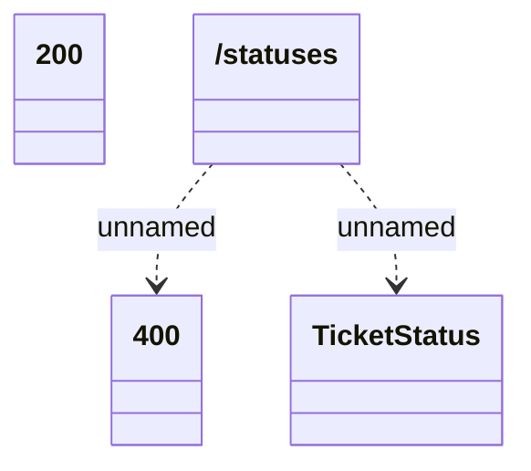

# listStatuses

- **Diagram Type**: Logical
- **Package**: HomerSelect/BSL/Modules/Ticketing (TCK)/Interface Provided/Web Services/Ticketing API/statuses
- **Diagram ID**: 159988
- **Elements**: 4
- **Connectors**: 2

