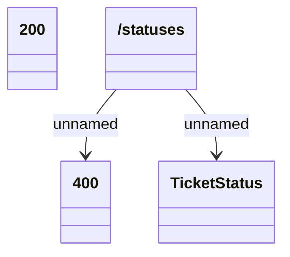

# listStatuses

```mermaid
classDiagram
    class TicketStatus["TicketStatus"]
    class n_200["200"]
    class n_400["400"]
    class statuses["/statuses"]
    statuses --> n_400 : unnamed
    statuses --> TicketStatus : unnamed
```
