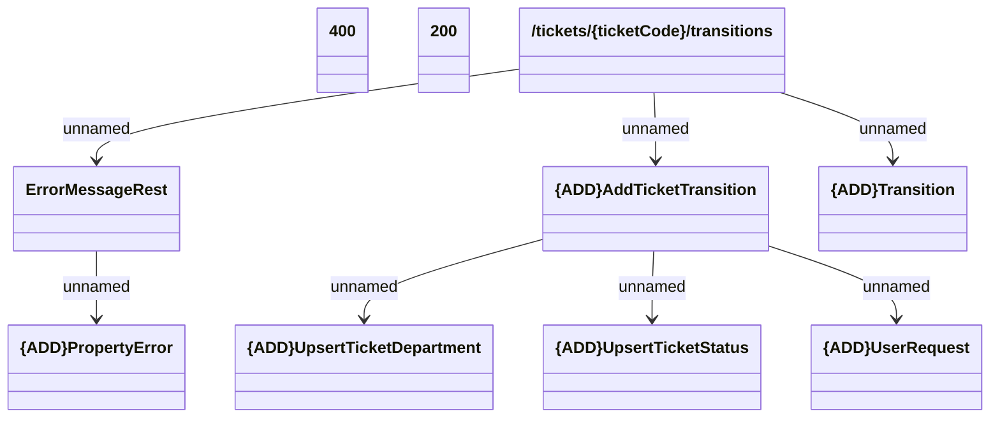

# addTransition

```mermaid
classDiagram
    class ADD_UpsertTicketStatus["{ADD}UpsertTicketStatus"]
    class ADD_UserRequest["{ADD}UserRequest"]
    class ADD_UpsertTicketDepartment["{ADD}UpsertTicketDepartment"]
    class ADD_AddTicketTransition["{ADD}AddTicketTransition"]
    class ADD_PropertyError["{ADD}PropertyError"]
    class n_400["400"]
    class n_200["200"]
    class ErrorMessageRest["ErrorMessageRest"]
    class ADD_Transition["{ADD}Transition"]
    class tickets_ticketCode_transitions["/tickets/{ticketCode}/transitions"]
    tickets_ticketCode_transitions --> ADD_Transition : unnamed
    tickets_ticketCode_transitions --> ErrorMessageRest : unnamed
    tickets_ticketCode_transitions --> ADD_AddTicketTransition : unnamed
    ADD_AddTicketTransition --> ADD_UpsertTicketDepartment : unnamed
    ADD_AddTicketTransition --> ADD_UpsertTicketStatus : unnamed
    ADD_AddTicketTransition --> ADD_UserRequest : unnamed
    ErrorMessageRest --> ADD_PropertyError : unnamed
```
