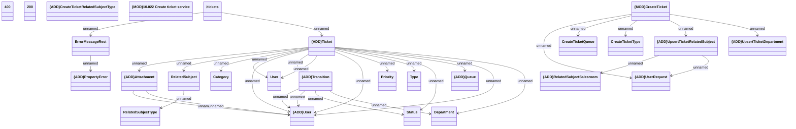

# createTicket

```mermaid
classDiagram
    class n_400["400"]
    class n_200["200"]
    class ADD_PropertyError["{ADD}PropertyError"]
    class ErrorMessageRest["ErrorMessageRest"]
    class ADD_Transition["{ADD}Transition"]
    class ADD_Attachment["{ADD}Attachment"]
    class ADD_User["{ADD}User"]
    class ADD_RelatedSubjectSalesroom["{ADD}RelatedSubjectSalesroom"]
    class ADD_UserRequest["{ADD}UserRequest"]
    class ADD_CreateTicketRelatedSubjectType["{ADD}CreateTicketRelatedSubjectType"]
    class ADD_UpsertTicketRelatedSubject["{ADD}UpsertTicketRelatedSubject"]
    class ADD_UpsertTicketDepartment["{ADD}UpsertTicketDepartment"]
    class ADD_Queue["{ADD}Queue"]
    class Priority["Priority"]
    class Status["Status"]
    class MOD_10_022_Create_ticket_service["{MOD}10.022 Create ticket service"]
    class RelatedSubject["RelatedSubject"]
    class User["User"]
    class RelatedSubjectType["RelatedSubjectType"]
    class Department["Department"]
    class tickets["/tickets"]
    class ADD_Ticket["{ADD}Ticket"]
    class CreateTicketType["CreateTicketType"]
    class CreateTicketQueue["CreateTicketQueue"]
    class MOD_CreateTicket["{MOD}CreateTicket"]
    class Type["Type"]
    class Category["Category"]
    MOD_CreateTicket --> ADD_UserRequest : unnamed
    tickets --> ErrorMessageRest : unnamed
    MOD_CreateTicket --> CreateTicketQueue : unnamed
    MOD_CreateTicket --> CreateTicketType : unnamed
    tickets --> ADD_Ticket : unnamed
    MOD_CreateTicket --> ADD_UpsertTicketRelatedSubject : unnamed
    MOD_CreateTicket --> ADD_UpsertTicketDepartment : unnamed
    ADD_UpsertTicketRelatedSubject --> ADD_RelatedSubjectSalesroom : unnamed
    ADD_UpsertTicketRelatedSubject --> ADD_UserRequest : unnamed
    ErrorMessageRest --> ADD_PropertyError : unnamed
    ADD_Ticket --> ADD_Attachment : unnamed
    ADD_Attachment --> ADD_User : unnamed
    ADD_Attachment --> ADD_User : unnamed
    RelatedSubject --> RelatedSubjectType : unnamed
    ADD_Ticket --> RelatedSubject : unnamed
    ADD_Ticket --> Category : unnamed
    ADD_Ticket --> User : unnamed
    ADD_Ticket --> ADD_User : unnamed
    ADD_Ticket --> ADD_Transition : unnamed
    ADD_Ticket --> User : unnamed
    ADD_Ticket --> ADD_User : unnamed
    ADD_Ticket --> Priority : unnamed
    ADD_Ticket --> Type : unnamed
    ADD_Ticket --> Status : unnamed
    ADD_Ticket --> ADD_Queue : unnamed
    ADD_Ticket --> ADD_User : unnamed
    ADD_Ticket --> Department : unnamed
    ADD_Transition --> ADD_User : unnamed
    ADD_Transition --> ADD_User : unnamed
    ADD_Transition --> Status : unnamed
    ADD_Transition --> Department : unnamed
```
