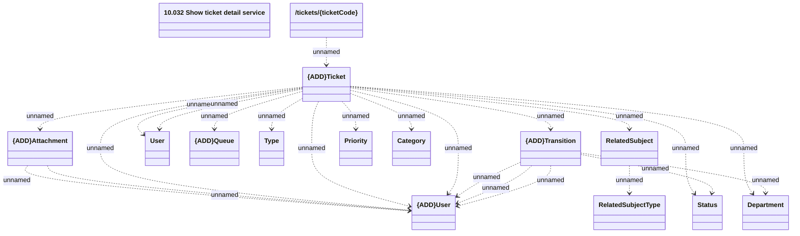

# getTicket

- **Diagram Type**: Logical
- **Package**: HomerSelect/BSL/Modules/Ticketing (TCK)/Interface Provided/Web Services/Ticketing API/tickets/getTicket
- **Diagram ID**: 162955
- **Elements**: 15
- **Connectors**: 23

