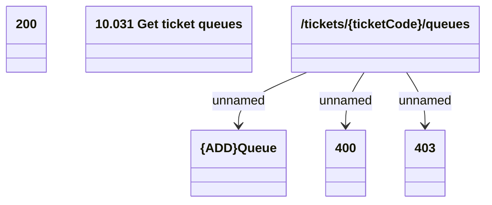

# getTicketQueues

```mermaid
classDiagram
    class n_403["403"]
    class n_400["400"]
    class n_200["200"]
    class n_10_031_Get_ticket_queues["10.031 Get ticket queues"]
    class ADD_Queue["{ADD}Queue"]
    class tickets_ticketCode_queues["/tickets/{ticketCode}/queues"]
    tickets_ticketCode_queues --> ADD_Queue : unnamed
    tickets_ticketCode_queues --> n_400 : unnamed
    tickets_ticketCode_queues --> n_403 : unnamed
```
