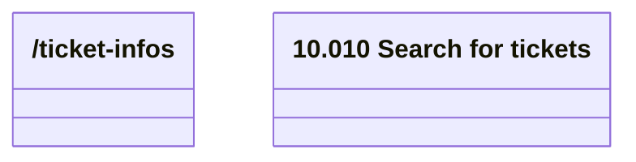

# ticketInfos

- **Diagram Type**: Logical
- **Package**: HomerSelect/BSL/Modules/Ticketing (TCK)/Interface Provided/Web Services/Ticketing API/tickets/search
- **Diagram ID**: 162956
- **Elements**: 3
- **Connectors**: 0

