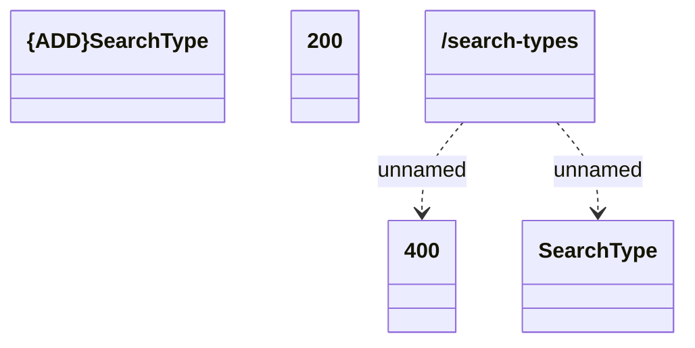

# listSearchTypes

- **Diagram Type**: Logical
- **Package**: HomerSelect/BSL/Modules/Ticketing (TCK)/Interface Provided/Web Services/Ticketing API/types/listSearchTypes
- **Diagram ID**: 159963
- **Elements**: 5
- **Connectors**: 2

